# Minecraft Server Manager

A complete, self-hosted control panel for Minecraft servers that run as Docker containers on the
excellent [itzg/docker-minecraft-server](https://github.com/itzg/docker-minecraft-server) image.
It aims to rival commercial panels (Pterodactyl, Multicraft, AMP) in polish and capability while
staying entirely free and local: multi-server lifecycle, pinned modpacks, a shared deduplicated mod
library, player moderation, crash forensics, backups, schedules, portable server "blueprints",
storage analytics, a live world map, and more — wrapped in a fast, Minecraft-flavored web UI.

**Zero paid services. Everything runs on your machine, and your entire panel is one folder you can
copy to migrate.**

<p align="center">
  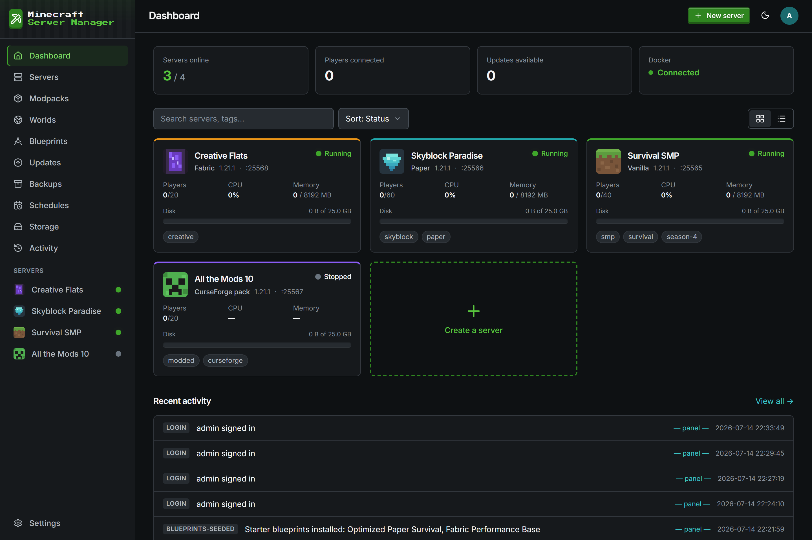
</p>

---

## Features

**Core**

- **Multi-server lifecycle** — create / start / stop / restart / recreate / delete, with graceful
  RCON `stop` before container stop, health-aware status, and crash detection with backoff.
- **Guided wizard** — Simple mode (the common knobs) or Advanced mode exposing every environment
  variable the image supports, each with plain-English help, grouped by section, plus a raw
  `KEY=value` escape hatch. Only non-default values are applied.
- **Modpacks are always pinned** — "latest" is resolved to a concrete version id at install time and
  pinned, so the image never silently upgrades a pack on restart. Upgrades are explicit: preview →
  automatic pre-update backup → graceful stop → re-pin → recreate → health monitoring → **one-click
  rollback** if it doesn't come up.
- **Custom-mod overlay** — mods you add yourself are downloaded into a shared, sha256-deduplicated
  library and hard-linked into the server; they survive pack updates. Disabling is class-aware
  (overlay mods rename to `.disabled`; pack-managed mods use the image's exclusion mechanism).
- **Console, logs & RCON** — live console over WebSocket, ANSI rendering, search/level filters, a
  command bar with history, and a player list with quick actions. Every server gets a generated,
  encrypted RCON password injected automatically.
- **Player moderation** — whitelist, ops (levels 1–4), bans, IP bans; via RCON while running and via
  direct JSON edits while stopped ("applies on start"). Teleport by coordinates, to a player, or to
  the nearest biome.
- **Backups & schedules** — save-safe archive/restore with retention classes and free-space
  preflight; per-server and global cron tasks (restart / backup / RCON) with next-run previews.
- **Blueprints (`.mcserver.zip`)** — a portable recipe of an instance: full config (secrets
  stripped), resource limits, the pinned pack reference, the custom-mod overlay manifest (source
  URLs + hashes), chosen config files, and optionally an embedded world. Import reproduces the same
  server with fresh ports and per-mod hash-verified downloads. Clone = export + import.
- **Storage analytics & quotas** — a background size-indexer walks `./data`, caches sizes, and
  panel-enforces per-server disk quotas (Docker can't cap bind-mount usage); usage breakdowns,
  largest-files, orphan detection, and trend charts.
- **History & crash reports** — every action (lifecycle, config diffs, mods, packs, backups, RCON,
  player actions, schedules) is a structured event with actor and captured log excerpts. Crash
  reports are auto-detected, parsed (exception + suspected mods), and exportable.

**Beyond the basics** (all shipped, all self-hosted)

- **Live world map** — one click installs BlueMap matched to the server's loader, allocates a port,
  and embeds it in a tab served only through the panel's authenticated proxy.
- **Analytics & scoreboard** — vanilla stats ingested on a schedule (playtime, deaths, kills,
  blocks/diamonds mined, distance), per-player profiles, and a rankable scoreboard.
- **Activity timeline** — every log line classified (chat, joins, leaves, deaths incl. PvP,
  advancements) into a searchable per-server timeline. Chat is captured locally only.
- **Inventory forensics** — read any player's inventory/armor/ender chest from playerdata NBT,
  automatic snapshots on join/death, side-by-side snapshot diffs, cross-player item search,
  give/clear via RCON.
- **Investigation** — advisory x-ray suspicion scoring from ore-discovery ratios vs the server
  median; evidence laid out, never auto-punishing.
- **Discord** — webhook notifications (lifecycle, crashes, backups, updates, player actions) with
  per-event toggles; URLs stored encrypted.
- **Invites & client modpacks** — a paste-ready invite block plus a generated client `.mrpack` with
  the server pre-added to the in-game server list.
- **Pick-mods-first solver** — choose the mods you want; the solver intersects Modrinth metadata to
  propose the newest fully-compatible loader + MC version pair and installs the set on creation.
- **Public status page** — optional unauthenticated `/status/<slug>` per server (name, version,
  player count only).

---

## Screenshots

<table>
  <tr>
    <td width="50%">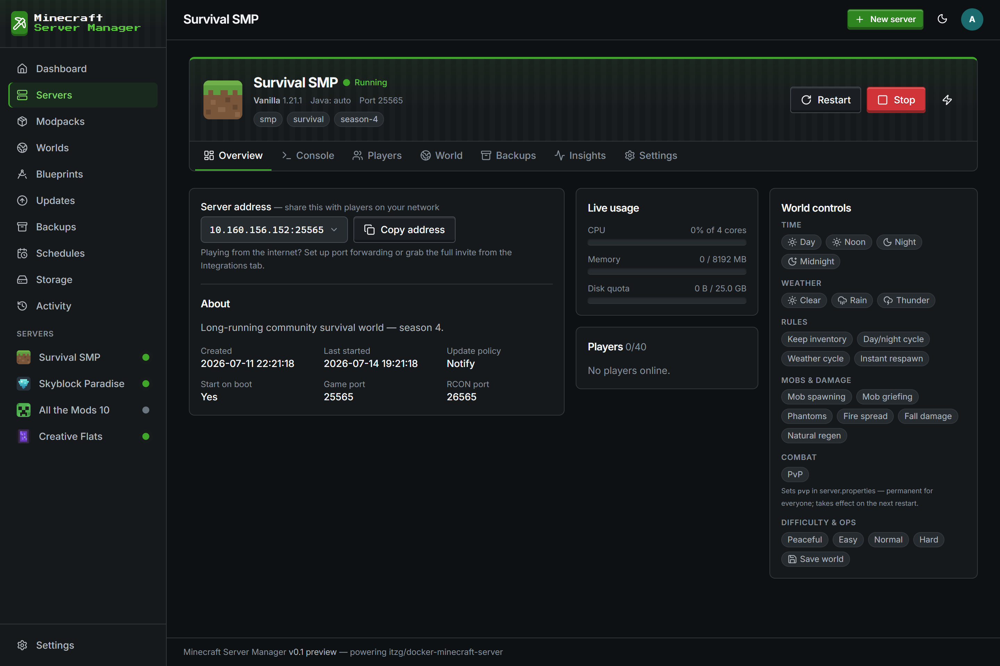<br><sub><b>Server overview & controls</b> — connect address, live usage, and the world-controls rail that rides along on every tab.</sub></td>
    <td width="50%">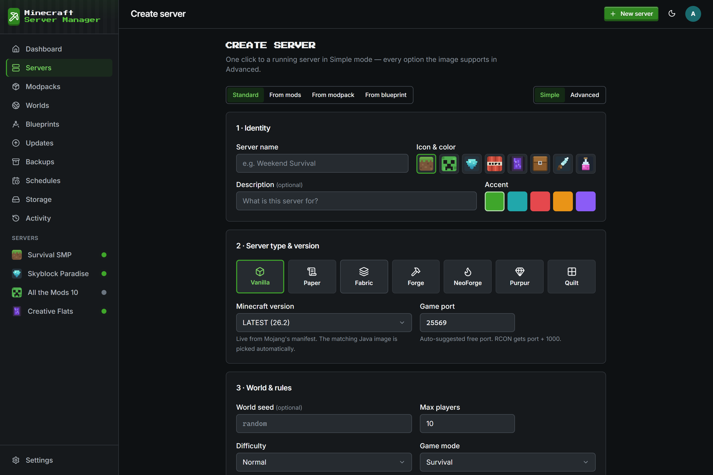<br><sub><b>Guided create wizard</b> — Simple or Advanced; every <code>server.properties</code> knob applied from the first start.</sub></td>
  </tr>
  <tr>
    <td>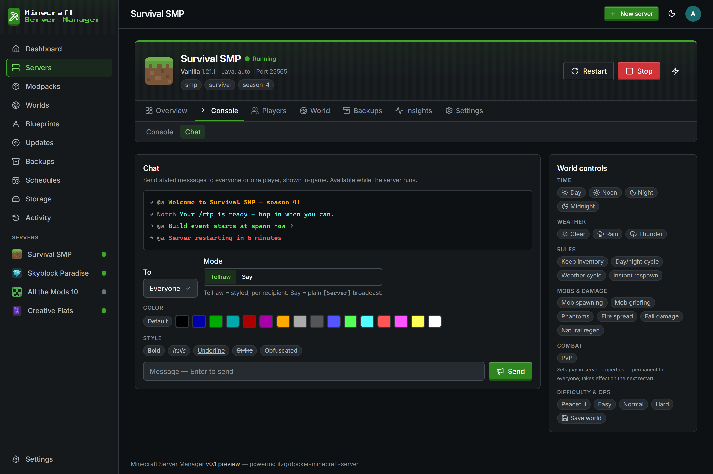<br><sub><b>Admin chat</b> — styled <code>tellraw</code>/<code>say</code> to everyone or one player: colors, bold/italic/underline, chat-style log.</sub></td>
    <td>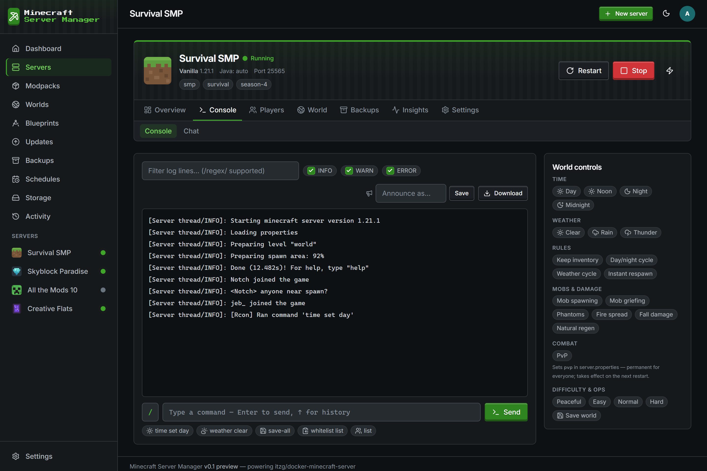<br><sub><b>Live console &amp; RCON</b> — streamed logs with level filters and a command bar with history.</sub></td>
  </tr>
  <tr>
    <td>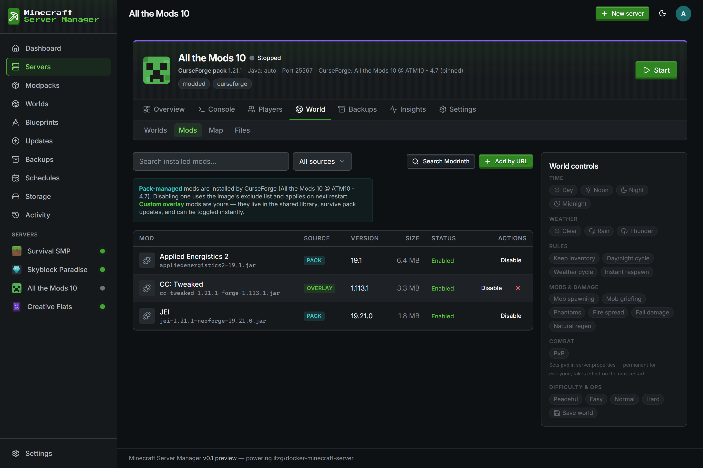<br><sub><b>Mods &amp; plugins</b> — pack-managed + custom overlay, one-click toggle, Modrinth/CurseForge search.</sub></td>
    <td>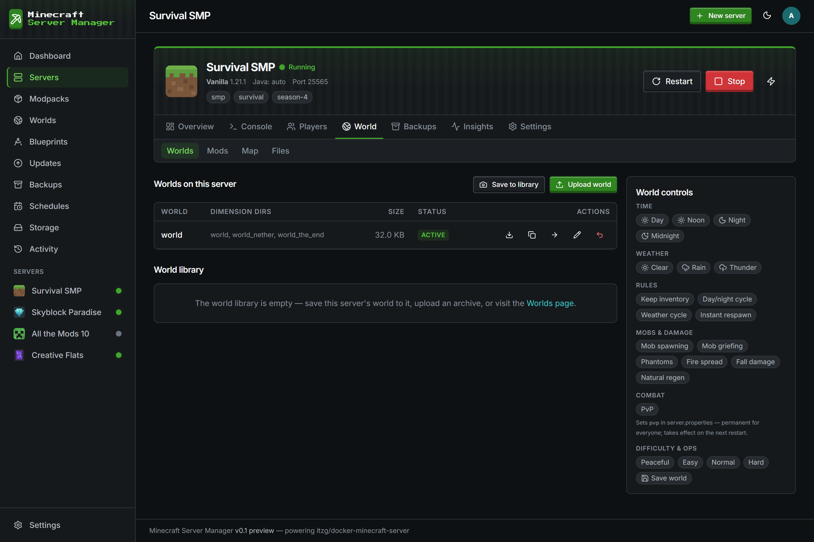<br><sub><b>Worlds</b> — reset/re-roll with a custom or random seed, duplicate, and a shared world library.</sub></td>
  </tr>
  <tr>
    <td>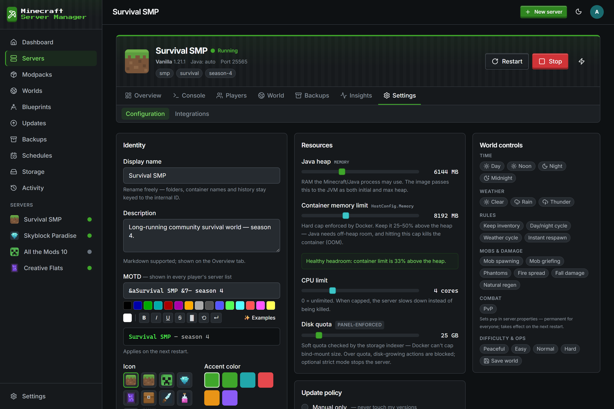<br><sub><b>Settings</b> — the full image env catalog with plain-English help, resource sliders, and a MOTD editor.</sub></td>
    <td>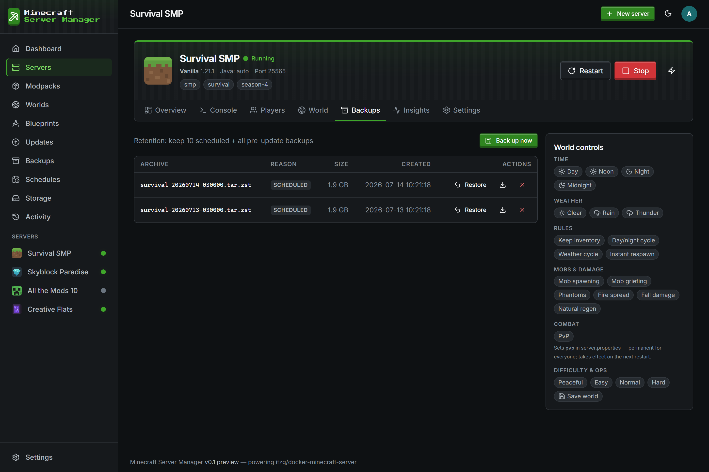<br><sub><b>Backups</b> — save-safe archives with retention classes and one-click restore.</sub></td>
  </tr>
  <tr>
    <td>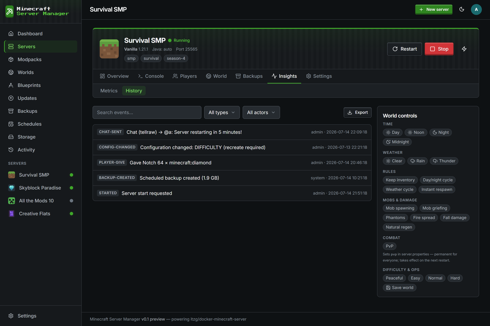<br><sub><b>History</b> — every action is a structured event with its actor and captured log excerpts.</sub></td>
    <td>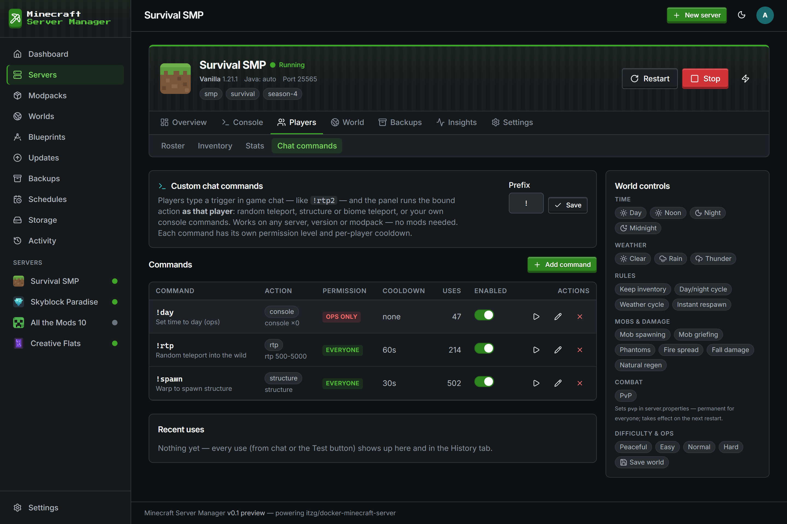<br><sub><b>Custom chat commands</b> — owner-defined <code>!triggers</code> (RTP, warp, console) with cooldowns &amp; permissions.</sub></td>
  </tr>
  <tr>
    <td>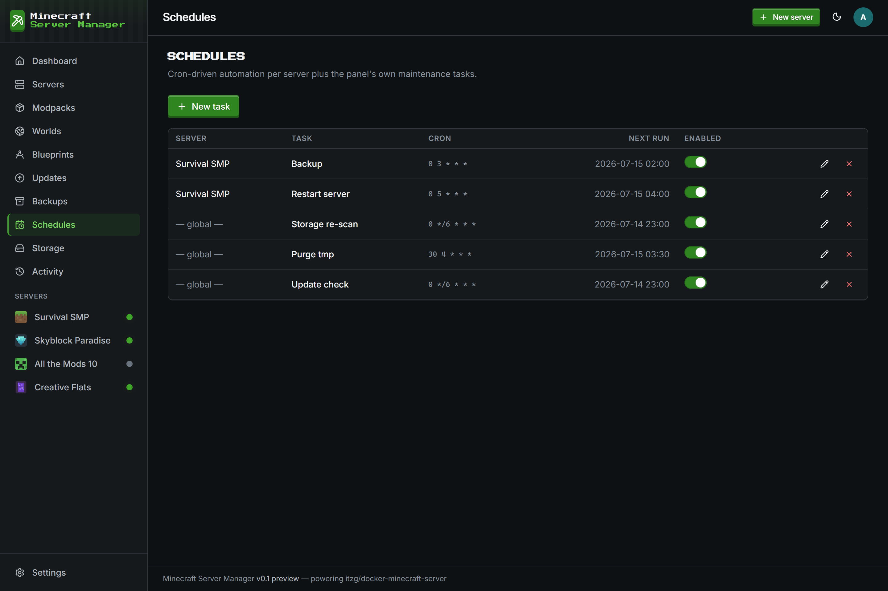<br><sub><b>Schedules</b> — per-server and global cron tasks (restart / backup / RCON) with next-run previews.</sub></td>
    <td>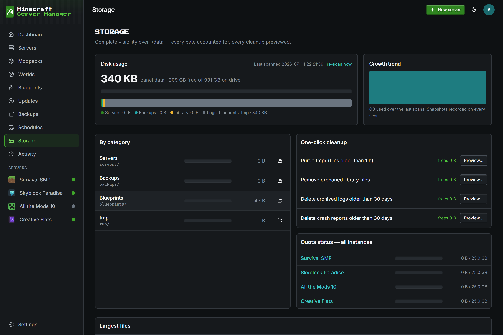<br><sub><b>Storage analytics</b> — per-server usage, largest files, orphan detection, and panel-enforced quotas.</sub></td>
  </tr>
  <tr>
    <td>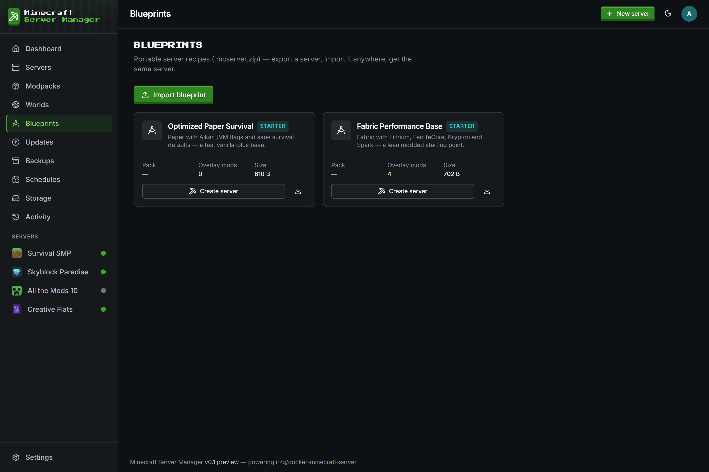<br><sub><b>Blueprints</b> — portable <code>.mcserver.zip</code> recipes; export a server, import it anywhere, get the same server.</sub></td>
    <td></td>
  </tr>
</table>

## Requirements

- **Node.js 24+** (current LTS) — uses the built-in `node:sqlite` (flagless from Node 24), so there are
  **no native modules to compile**. The panel prints a clear message and exits if run on an older Node.
- **Docker**
  - **Windows:** Docker Desktop (WSL2 backend). The panel talks to `\\.\pipe\docker_engine`.
  - **macOS:** Docker Desktop (`/var/run/docker.sock`).
  - **Linux:** Docker Engine (`/var/run/docker.sock`; add your user to the `docker` group).
- A few GB of disk for server images + worlds.

The panel and the Docker daemon are expected to run on the **same host** (server data is bind-mounted
by host path).

## Quick start

```bash
git clone <this-repo> minecraft-server-manager
cd minecraft-server-manager
npm install               # installs deps and builds the Tailwind CSS (postinstall)
cp .env.example .env      # optional — all values have sane defaults
npm start                 # or: npm run dev (auto-restart + CSS watch)
```

Open **http://localhost:25564**. By default the panel binds to **localhost only** (`127.0.0.1`), so it's
reachable just from this machine — set `PANEL_HOST=0.0.0.0` to reach it across your LAN. The **first run**
walks you through a system check, choosing your time zone, and creating the admin account. If Docker
isn't running you still get the full UI — the lifecycle features light up when the daemon comes up.

You do **not** need to set anything in `.env` to start: on first run the panel generates a strong
random secret and persists it under your data directory (`data/.session-secret`). Set `SESSION_SECRET`
yourself only if you want to control it (e.g. to share one across replicas).

### Configuration (`.env`, all optional)

| Variable                                                                    | Default                    | Purpose                                                                                                                                                          |
| --------------------------------------------------------------------------- | -------------------------- | ---------------------------------------------------------------------------------------------------------------------------------------------------------------- |
| `DATA_DIR`                                                                  | `./data`                   | Root for **all** panel state (DB, server data, backups, library).                                                                                                |
| `PANEL_HOST` / `PANEL_PORT`                                                 | `127.0.0.1` / `25564`      | Web UI bind address + port. Localhost-only by default; set `PANEL_HOST=0.0.0.0` for LAN access.                                                                  |
| `SESSION_SECRET`                                                            | auto-generated             | Signs session cookies + derives the at-rest encryption key. Auto-created and persisted if unset.                                                                 |
| `TRUST_PROXY` / `COOKIE_SECURE`                                             | —                          | Set when behind a TLS-terminating reverse proxy, so `req.ip` (rate-limiting) and `Secure` cookies work.                                                          |
| `DOCKER_HOST`                                                               | auto-detected              | Docker endpoint override for rootless Docker, Podman, or a remote daemon (per-OS socket/pipe otherwise).                                                         |
| `CF_API_KEY`                                                                | —                          | Optional [CurseForge API key](https://console.curseforge.com/) to seed on first run (also settable in the UI). Wrap in single quotes; CF keys often contain `$`. |
| `MC_IMAGE_REPO`                                                             | `itzg/minecraft-server`    | Docker image repo for servers; override for a private mirror / air-gapped registry.                                                                              |
| `DEFAULT_HEAP_MB` / `DEFAULT_CONTAINER_MEMORY_MB` / `DEFAULT_DISK_QUOTA_GB` | host-aware                 | Starting resource defaults for new servers. Clamped to your host RAM when unset.                                                                                 |
| `PORT_GAME_START` / `PORT_RCON_OFFSET` / `PORT_BEDROCK_START`               | `25565` / `1000` / `19132` | Port allocation scheme.                                                                                                                                          |

> **Exposure:** the panel binds to localhost by default. Set `PANEL_HOST=0.0.0.0` for LAN access, and only
> put it on the internet behind a reverse proxy with TLS (set `TRUST_PROXY` + `COOKIE_SECURE`). Auth is
> mandatory from the first run.

> **Time zone & region:** picked during first-run setup (auto-detected from your system) and changeable
> in Settings. All dates and player-activity times display in the zone you choose.

### Windows notes

- Docker Desktop must be running before you start/create servers.
- Share your project drive with Docker Desktop (Settings → Resources → File sharing) so bind mounts
  work. The panel's Docker status endpoint tells you if the daemon is unreachable.
- Bind mounts on Docker Desktop are slower than named volumes; the panel uses bind mounts anyway
  because _portability wins_ — your entire panel is one folder.

---

## Networking, ports & remote access

A fresh install is **localhost-only** — it answers only at `http://localhost:25564` on the machine
it runs on. This section covers how to reach it from elsewhere and exactly which ports to open.

### Ports at a glance

| What                     | Port(s)                                      | Protocol  | Open to the internet?                     |
| ------------------------ | -------------------------------------------- | --------- | ----------------------------------------- |
| **Admin panel (web UI)** | `PANEL_PORT` — default **25564**             | TCP       | Only behind TLS (reverse proxy), not raw  |
| **Game server (Java)**   | from `PORT_GAME_START` (**25565**) upward    | TCP + UDP | **Yes** — this is how players connect     |
| **RCON**                 | game port **+ 1000** (from **26565**)        | TCP       | **No — never.** Panel-internal management |
| **Bedrock / Geyser**     | from `PORT_BEDROCK_START` (**19132**) upward | UDP       | Only if you run Bedrock                   |
| **Live map (BlueMap)**   | auto-allocated                               | TCP       | **No** — served through the panel's proxy |

The panel itself sits at **25564** — one below the game runway — so game instances count cleanly
upward from 25565 with nothing interrupting the sequence. Game ports are then assigned **first-free**,
one game + RCON pair per server. Ten servers therefore occupy game `25565–25574` (TCP+UDP), RCON
`26565–26574` (TCP), and — where Bedrock is enabled — `19132+` (UDP). The 1000-port RCON offset is
deliberate: it keeps RCON in a separate block so you can open a contiguous **game** range without ever
exposing RCON.

> **Why RCON must stay closed:** RCON is a plaintext remote-admin protocol guarded only by a password.
> The panel reaches it via `docker exec` _inside_ the container, so the host RCON port is never needed
> from outside — leave `26565+` blocked at the firewall.

### Reach the panel from another machine

The panel binds to `127.0.0.1` out of the box. To listen on all interfaces, set in `.env`:

```env
PANEL_HOST=0.0.0.0
PANEL_PORT=25564
```

Restart the panel so it re-reads the environment — **and under PM2 you must pass `--update-env`**, or
PM2 keeps the old value:

```bash
pm2 restart <id> --update-env      # PM2 — --update-env is essential
# or restart however you launched it
```

Confirm the bind address actually changed:

```bash
ss -tlnp | grep 25564              # want 0.0.0.0:25564, not 127.0.0.1:25564
```

Then open the panel port in **both** the host firewall and — on a VPS — your provider's separate
cloud firewall (the one people forget):

```bash
sudo ufw allow 25564/tcp                                                            # ufw
# sudo firewall-cmd --add-port=25564/tcp --permanent && sudo firewall-cmd --reload  # firewalld
```

### Open game ports for players

Open a range sized to how many servers you plan to run. Game ports are **TCP and UDP** — UDP carries
the query protocol on the same port:

```bash
sudo ufw allow 25565:25584/tcp
sudo ufw allow 25565:25584/udp
sudo ufw allow 19132:19141/udp     # Bedrock / Geyser — only if used
```

Do **not** add a rule for the RCON range (`26565+`).

### Do it safely (recommended)

Exposing the raw panel port on the internet means logins travel over **plain HTTP**. Prefer one of:

- **Reverse proxy with TLS** — keep `PANEL_HOST=127.0.0.1`, terminate HTTPS in front, and set
  `TRUST_PROXY=1` + `COOKIE_SECURE=auto`. Minimal [Caddy](https://caddyserver.com/):

  ```
  mc.example.com {
      reverse_proxy 127.0.0.1:25564
  }
  ```

  You then open only `80`/`443` — never `25564`.

- **SSH tunnel** — no exposure, no firewall change, just for you:

  ```bash
  ssh -L 25564:127.0.0.1:25564 user@your-server     # then open http://localhost:25564 locally
  ```

### Running under a process manager (PM2 / systemd)

The panel requires **Node.js 24+** (built-in `node:sqlite`). Gotcha with **PM2**: it launches apps
with whatever Node version started the PM2 _daemon_, and later switching your shell with `nvm` does
**not** change it — a restart can silently re-launch on the old version and fail the Node-24 preflight.
Pin the interpreter per app:

```bash
pm2 start src/server.js --name minecraft-server-manager --interpreter "$(nvm which 24)"
pm2 save
```

(or `pm2 kill && pm2 resurrect` to relaunch the whole daemon under your current default Node.)

---

## The `./data` directory — everything lives here

```
data/
  .session-secret        auto-generated panel secret (keep private; delete = rotate)
  panel.db               SQLite database (node:sqlite, WAL)
  servers/<id>/          bind-mounted as /data into each container (world, mods, configs…)
  backups/<id>/          backup archives
  blueprints/            .mcserver.zip exports
  library/mods/          shared mod/plugin jars, deduplicated by sha256
  library/modpacks/      pack archives
  library/worlds/        world archives (the world library)
  library/icons/         instance icons + cached mod icons
  logs/<id>/events/      captured log excerpts linked from history events
  tmp/                   in-flight downloads (wiped on boot)
```

**Copy `data/` to another machine → you migrated the whole panel.** Back it up like you'd back up a
world. Every file operation is contained to this root (path-guard enforced).

---

## How the important things work

### Two memory limits

- **Java heap** (`MEMORY`) — what Minecraft may use.
- **Container limit** (Docker `HostConfig.Memory`) — the hard cap; hitting it OOM-kills the server.

Keep the container limit 25–50% above the heap. The wizard does this automatically; the Settings
form validates it.

### Java version selection

The image does **not** pick Java for you. The panel maps MC version → image tag
(`java8/16/17/21/latest`) with a per-server override in Advanced settings.

### Disk quotas are panel-enforced

Docker can't cap bind-mount disk usage, so a background size-indexer walks `./data`, caches sizes in
SQLite, and blocks disk-growing operations (mod installs, backups, world uploads) for servers over
quota. Optional strict mode gracefully stops a runaway server past its quota.

### Secrets at rest

API keys and RCON passwords are encrypted with AES-256-GCM, using a key derived from `SESSION_SECRET`.
Blueprints never contain secrets. The panel refuses to set footgun env vars (`REMOVE_OLD_MODS`,
`LOAD_ENV_FROM_*`).

### Password recovery

There is no self-service password reset (the panel has no email/SMTP dependency by design). If you're
locked out, stop the panel and reset the admin password with the maintenance script:

```bash
node scripts/reset-password.js <username>
```

---

## Security

- **Localhost-only by default** — binds `127.0.0.1` out of the box; LAN/internet exposure is an explicit opt-in.
- Session auth (SQLite-backed), bcrypt password hashes, login rate-limiting, first-run admin setup.
- Roles: **admin / operator / viewer**, enforced on every mutating request (user management in Settings).
- `SameSite=Strict` cookies + Origin checks on all state-changing requests; WebSockets authenticate
  the session cookie on upgrade. Security headers (CSP, `X-Frame-Options`, `nosniff`) on every response.
- Secrets encrypted at rest (AES-256-GCM), and never readable through the file manager. Blueprints strip
  secrets on export.
- Every file path is validated against escape from `./data`; archive extraction is zip-slip-guarded
  and size-capped. Server-side downloads (mods, icons) are SSRF-guarded against private/internal addresses.

## Architecture

```
src/
  config/      env config + the FIELD CATALOG (every itzg var with friendly help text)
  db/          node:sqlite wrapper + versioned migrations
  storage/     data-root bootstrap, path guard, size indexer + quotas
  events/      recordEvent() — the single history entry point
  docker/      dockerode: connect, containers, logs, stats, images, event watcher
  services/    domain logic (servers, ports, library, mods, packs, backups, players, …)
  updates/     update checker + safe-upgrade orchestrator (rollback)
  crashes/     crash watcher + parser
  blueprints/  export / import / clone + starter blueprints
  ws/          live console + stats WebSockets
  web/         express app, routes (pages + /api), view models, middleware
  utils/       shared helpers (httpError, ansi, …)
views/         handlebars layouts / partials / pages (server-rendered)
public/        built CSS, icon system, shared js/lib/* UI components
```

The layering rule: **routes (HTTP) → services (domain logic) → docker/db/storage (infrastructure).**
The field catalog in `src/config/` is the single source of truth for server settings. See
[`docs/architecture.md`](docs/architecture.md) and [`CONTRIBUTING.md`](CONTRIBUTING.md).

## Scripts

| command              | what it does                                            |
| -------------------- | ------------------------------------------------------- |
| `npm run dev`        | app with auto-restart + Tailwind watch                  |
| `npm start`          | production start                                        |
| `npm run build`      | minified CSS build (also runs automatically on install) |
| `npm run lint`       | ESLint over `src/`, `scripts/`, `public/js/`, `test/`   |
| `npm run format`     | Prettier — format the tree                              |
| `npm run typecheck`  | `tsc --checkJs` over the type-clean core                |
| `npm test`           | unit tests (`node:test`) — runs on a clean clone        |
| `npm run test:smoke` | live QA sweep against a running panel (needs Docker)    |

## Status & areas that need work

This is an early public release (`v0.1.0`). The core lifecycle is solid, but several features are
deliberately "good enough for now" — honest contribution targets rather than finished work. If you
want to help, start here.

- **Custom RTP (random teleport)** — the panel's own random-teleport picks a point in a ring around
  the player and lands them on the highest solid block via `spreadplayers`. It retries a few times to
  dodge ocean/void, but there's **no real safety scan** — you can still land on tree canopy, a cave
  roof, or an exposed cliff. It's **online-only**, runs **one search at a time per server** (a
  `/locate`/`spreadplayers` sweep briefly stalls the server's main thread), seeds distance from the
  player's **last-saved** position (can be stale), and its point distribution clusters toward the
  centre rather than being area-uniform.

- **Structure finding** — nearest-structure teleport uses a bundled vanilla list plus a best-effort
  scan of the server's structure tags for modded content. Each structure's home dimension is a static
  lookup that **defaults to the Overworld**, so a modded structure that only generates elsewhere can
  fail to locate. "Surprise me" just searches from a random ring point, not a genuinely random
  structure. Online-only, same main-thread stall.

- **Biome finding** — modded biomes are only discovered on **Forge/NeoForge** (via their registry-tag
  commands). On Fabric/Quilt/Paper the picker falls back to the bundled **vanilla** biome list, so
  modded biomes won't appear, and cross-dimension biome mapping is partly heuristic.

- **Giving / taking items** — give and clear go over RCON and are **online-only**. `give` hands over a
  **plain stack — no enchantments, custom NBT/components, names, or contents** (you can't give an
  enchanted or renamed item from the UI yet). Per-slot god-mode editing _can_ preserve component data
  offline (direct `.dat` rewrite), but a **live count change resets custom components**, and offline
  edits are refused while the player is online.

- **Item listing** — the JEI-style registry is built offline from each server's own jar lang files, so
  it works for any loader/pack, but it's **`en_us` only**, covers only `item.*`/`block.*` names, and so
  **misses datapack-added items, entities, and anything without a lang entry**. It's names + ids only —
  **no icons/textures, NBT variants, or recipes** (not a full JEI). Listing and giving aren't fully
  wired together: you can find an item but only give its plain form.

- **Live map (BlueMap)** — one-click install works, but it only takes effect on the **next restart**,
  only manages `accept-download: true` (no in-panel render/marker/storage config), supports a **fixed
  set of server types**, and the map's web server is bound on all host interfaces — reach it **only**
  through the panel's authenticated proxy and **don't open that port in your firewall** (binding it
  loopback-only is on the list).

- **General** — much of the god-mode surface is **online/RCON-first** with thinner offline paths;
  several version-specific assumptions (1.20.5 item components, 1.21.5 `equipment` layout) are
  confirmed only against a handful of versions and may drift; and there's no automated end-to-end
  coverage of these live-server flows yet beyond the manual `npm run test:smoke` sweep.

## Contributing

Issues and PRs welcome. Please read [`CONTRIBUTING.md`](CONTRIBUTING.md) first — it covers the layer
rule, the two non-obvious conventions (path-guarded `./data` access and lazy-requires for cycle
breaking), and how to run the QA sweep.

## License

[MIT](LICENSE). Not affiliated with Mojang, Microsoft, or itzg; it builds on the open-source
`itzg/docker-minecraft-server` image (used unmodified).
