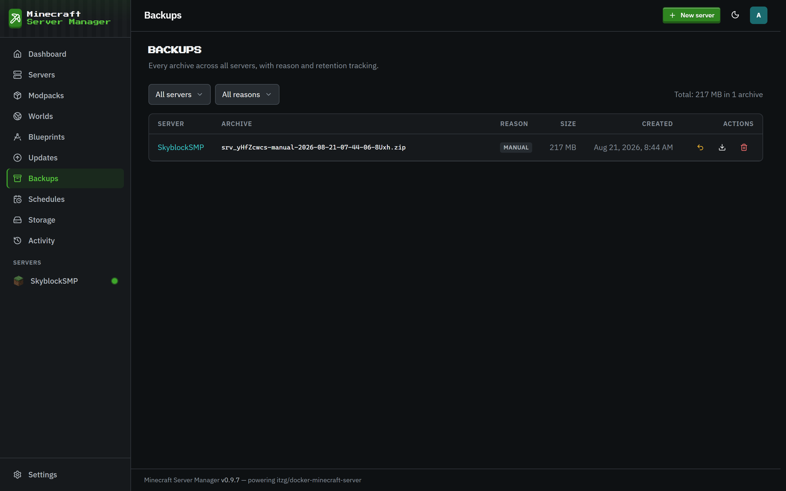
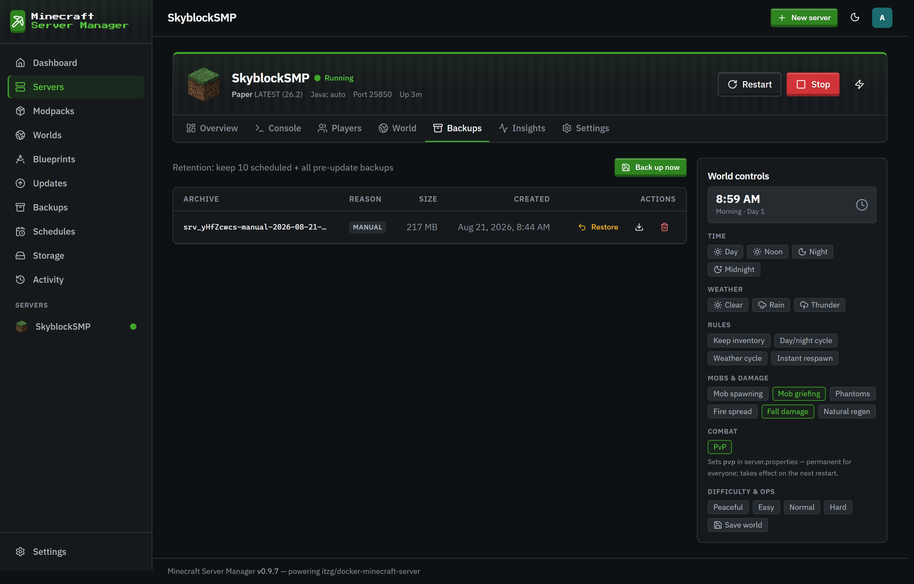

# Backups

[← Back to docs index](README.md)

The **Backups** page is every snapshot across your fleet, with size, reason, and age.

## Creating a backup

From a server's **Backups** tab (or via a [schedule](schedules.md)) you can snapshot the whole server directory in one click. The panel quiesces the world first (`save-off` → `save-all`), zips the data, then re-enables saving (`save-on`), so backups are consistent even on a running server. Each backup can carry a note.

## Backup reasons

Backups are tagged by why they were taken:

- **manual** — you clicked the button.
- **scheduled** — created by a [schedule](schedules.md).
- **pre-update** — taken automatically before a pack upgrade, so an upgrade is always reversible.

## Restoring

Restoring a backup stops the server, replaces its world data with the snapshot, and leaves it stopped for you to start again. Because pack upgrades always take a pre-update backup first, you can always roll back a bad upgrade.

> Backups count toward a server's [disk quota](storage.md), so keep an eye on how many you retain for large modded servers.
