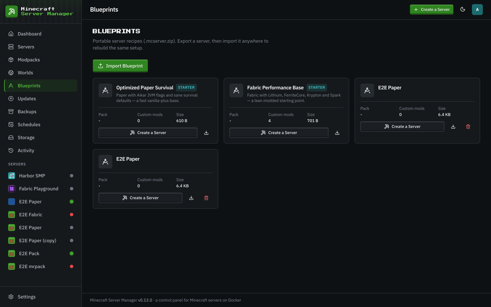

# Blueprints

[← Back to docs index](README.md)

A **blueprint** captures a server's whole configuration - type, version, resources, environment, pack pin, and optionally its config and world - into a single portable file you can stamp new servers out of.

## Exporting

From a server, export a blueprint and choose what to include: configuration always, and optionally embedded files and the world. The result is saved to your blueprint library and can be downloaded to share.

## Importing & creating from a blueprint

Import a blueprint file (or pick one from the library) to create a new server pre-configured exactly like the original. It's the fastest way to:

- Spin up identical servers (a network of minigame servers, staging copies of production).
- Move a server between panels.
- Keep a known-good template you can always fall back to.

Because a blueprint records the exact [pack pin](modpacks.md), a modpack server recreated from a blueprint installs the same pinned version - no surprise upgrades.
