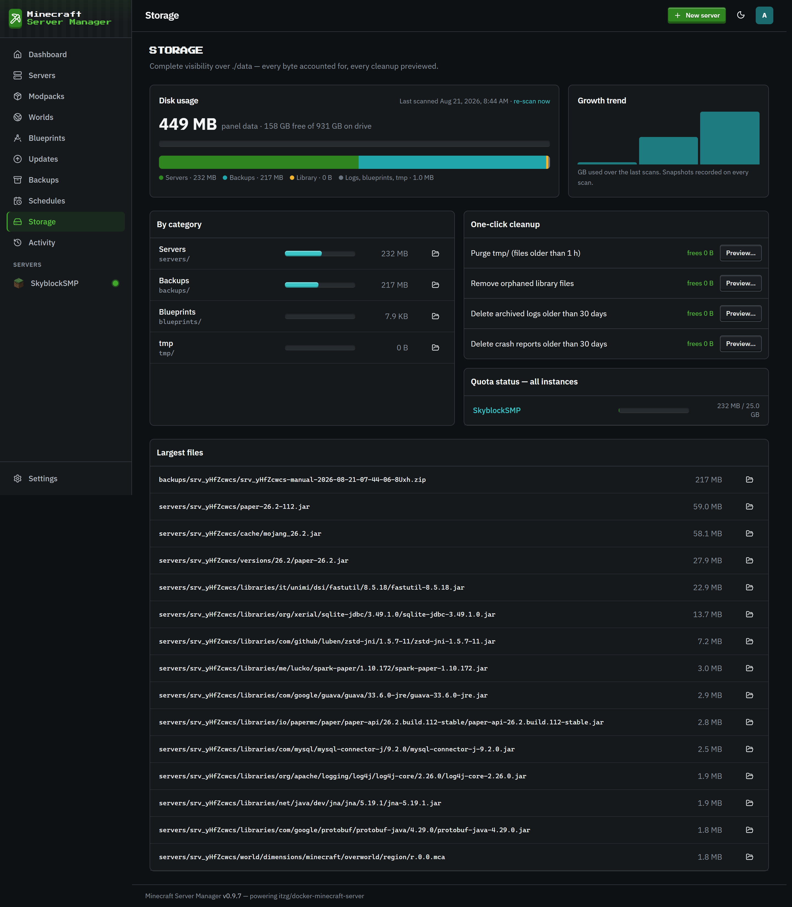

# Storage

[← Back to docs index](README.md)

The **Storage** page shows where your disk is going — per-server usage and how it's trending over time.

## Disk quotas are panel-enforced

Docker can't cap the disk usage of a bind mount, so the panel does it. A background size-indexer walks the data directory, caches each server's footprint, and enforces the disk quota you set per server. When a server's data (world + backups + everything else) approaches its quota, the panel stops runaway growth rather than letting one server fill your host.

Set a server's quota in its [settings](servers.md). Modded servers and their [backups](backups.md) can be large, so give them room.

## Cleanup

The Storage view helps you find what to prune — old backups, unused worlds, or a server that's grown far beyond expectations — before you run out of space.
